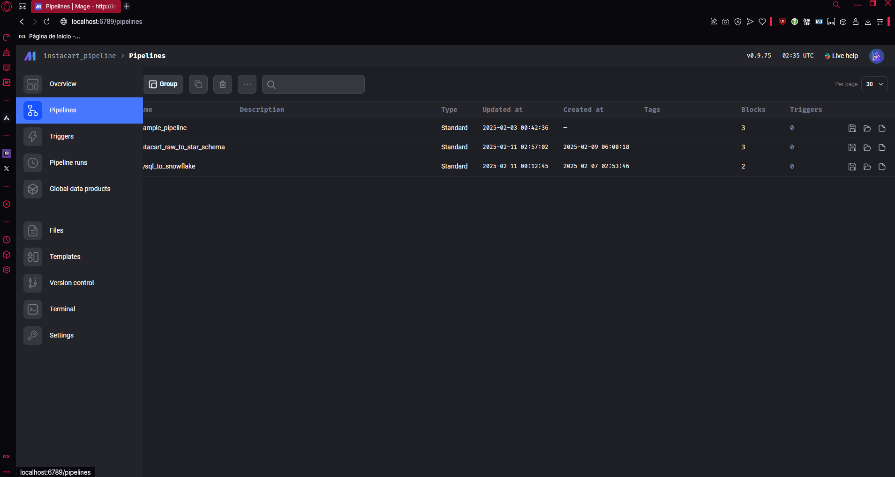
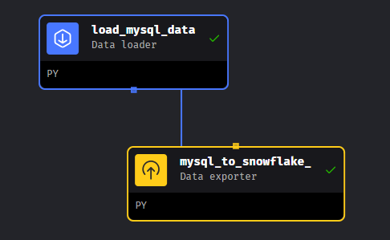
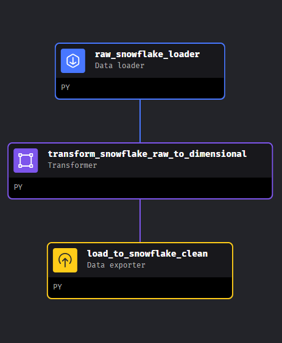

# Instacart Project

## 0. Antes de Empezar 

Verificar tener instalado y/o configurado 

- MySQL Sever
- Credenciales Snowflake (Cuenta de Snowflake)
- Python 


## 1. Exportacion de credenciales 

Para exportar las credenciales que se usaron en este proyecto existe un archivo .env.gpg, 
mediante terminal usar la siguiente linea de codigo.     


```eval $(gpg --decrypt .env.gpg 2>/dev/null | grep -v '^#') ``` 

- Esto solo cargara las credenciales en la sesion actual 
---
Recuerda estar en la ubicacion 

- ``` ...\instacart_project\scripts```

---
Si desear usar tus propias credenciales entra en:

- ``` nano ~/.bashrc ```

Coloca al final tus credenciales con este formato 

    export MYSQL_HOST="xxx"
    export MYSQL_USER="xxx"
    export MYSQL_PASSWORD="xxx"
    export MYSQL_DATABASE="xxx_db"
    export MYSQL_PORT="xxx"

    export SNOWFLAKE_ACCOUNT="xxx"
    export SNOWFLAKE_USER="xxx"
    export SNOWFLAKE_PASSWORD="xxx"
    export SNOWFLAKE_DATABASE="xxx"
    export SNOWFLAKE_WAREHOUSE="xxx"
    export SNOWFLAKE_SCHEMA="xxx"

Emplea este comando para cargarlas 

- ``` source ~/.bashrc```


## 2. Crear un ambiente virtual para ejecutar el proyecto y los scripts 

Cree un ambiente virtual empleando la version de python 3.10 (esta fue la version empleada para todo el proyecto)

```sudo add-apt-repository ppa:deadsnakes/ppa -y```-> El PPA de deadsnakes contiene versiones más recientes de Python.

``` sudo apt install python3.10 -y```-> Instala python 3.10

``` sudo apt install python3.10-venv ``` -> Instalara venv de python 3.10

``` python3.10 -m venv "nombre_de_tu_ambiente" ``` -> Crea el ambiente virtual (No olvides remplazar nombre_de_tu_ambiente con el nombre correspondiente)

```source nombre_de_tu_ambiente/bin/activate```  -> Activa el ambiente virtual

## 3. Instalar las dependencias 

En la carpeta instacart_project existe el archivo requirements.txt donde dispone todas las dependencias necesarias para poder ejecutar los distintos scripts de este proyecto. Recuerda haber activado el ambiente virtual

``` pip install -r ./requirements.txt  ```-> Esto instalara las dependencias necesarias

## 4. Uso del Script load_data

Para ejecutar el script emplea la siguiente linea

``` python3.10 load_data.py ``` -> El script creara la base de datos y cargara los datos .csv a la base de datos sql 

## 5. Uso de mage-ai para la creacion de las tuberia 

Para esto ya se debio instalar y montar el servidor de mage-ai, si desconoce el proceso para montar el servidor ingrese al siguiente enlace y siga los pasos correspondientes:
https://github.com/mage-ai/mage-ai/blob/master/README_dev.md

Una vez completado este paso, con el ambiente virtual activado ir a la carpeta en la terminal 

- ```...\instacart_project\data_pipeline_engine\```

Ejecutar el servidor de mage-ai con el Comando 

- ```mage start instacart_pipeline```

Una vez en el servidor de mage-ai ubicarse en la barra izquierda en la seccion de pipelines 



Aqui encontraremos 2 pipelines 

-     1. mysql_to_snowflake -> Realiza una exportacion de datos desde SQL local hacia Snowflake Schema RAW donde estan los datos crudos | 2 Bloques: Data Loader - Data Exporter





- Ejecutar El Bloque Data Loader primero dando click en el boton ▶️


- Una vez concluido el Data Loader ejecutar el Data Exporter dando click en el boton ▶️


----

-     2. instacart_raw_to_star_schema -> Realiza una carga de los datos desde el Schema RAW hacia mage-ai donde se realiza la transformacion de datos para luego de esto ser exportados al Schema CLEAN | 3 Bloques:  Data Loader - Transformer - Data Exporter



Una vez verificado la integridad de los datos en el Schema RAW

Ejecutar El Bloque Data Loader primero dando click en el boton ▶️


- Una vez concluido el Data Loader ejecutar Transformer dando click en el boton ▶️


- Una vez concluido Transformer ejecutar el Data Exporter dando click en el boton ▶️


## 6. Datos cargados correctamente 🎉 !

Felicidades los archivos han sido exportados, transformados y cargados y estan listo para usarse
